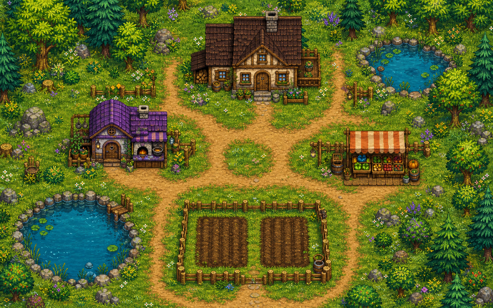

# Project Sprout

> 一款原创的 2D 像素农场生活游戏。开垦土地、照料作物、钓鱼、烹饪，并让自己的小农场慢慢热闹起来。

[下载 Windows 版](https://github.com/winter-68/farm-game-godot/raw/main/downloads/ProjectSprout-Windows.zip) · [查看设计文档](docs/README.md) · `Godot 4.7.1` · `Version 2`



## 游戏简介

**Project Sprout** 是一款围绕“轻松经营”展开的像素农场游戏。玩家从一小片土地开始：翻土、播种、浇水、等待作物成熟，再将收获卖给商店，换取下一轮经营所需的种子与装备。

农场并不只有田地。你可以在池塘垂钓，制作鱼饵并升级鱼竿；走进厨房把收获做成料理；与村民聊天、提升好感；在天气与季节变化中规划当天的行动。游戏的设计重点是节奏舒缓、操作直接、反馈清楚。

## 现有内容

| 系统 | 你可以做什么 |
| --- | --- |
| 农田经营 | 翻土、播种、浇水、等待成长、收获并出售多种作物。 |
| 时间、季节与天气 | 日夜推进、睡觉进入下一天；作物与可购买内容会受季节影响，天气会改变农场氛围。 |
| 钓鱼成长 | 在两处池塘钓鱼，使用不同鱼饵，积累经验并更换更好的鱼竿。 |
| 厨房与料理 | 进入厨房，将收获的食材制作成料理，并获得临时增益。 |
| 村民互动 | 与村民对话、提升好感，查看关系成长。 |
| 商店与背包 | 购买种子、出售作物和鱼类，整理背包与快捷栏。 |
| 收集目标 | 通过作物、鱼类与料理解锁收集进度和提示。 |
| 存档续玩 | 支持新游戏、继续游戏与本地 JSON 存档。 |

## 下载与开始

下载最新版：[**ProjectSprout-Windows.zip**](https://github.com/winter-68/farm-game-godot/raw/main/downloads/ProjectSprout-Windows.zip)

1. 解压下载的压缩包。
2. 双击运行 `ProjectSprout.exe`。
3. 如果 Windows 出现安全提示，选择“更多信息”，再选择“仍要运行”。

> 存档保存在本机用户目录中；更新游戏包不会主动删除已有存档。

## 操作说明

| 按键 | 功能 |
| --- | --- |
| `W` `A` `S` `D` | 移动角色 |
| `鼠标左键` / `J` | 使用当前快捷栏中的工具或种子 |
| `Space` | 收获面前成熟的作物 |
| `E` | 与门口、村民、池塘、取水点等高亮互动点互动 |
| `1`–`0` | 切换快捷栏物品 |
| `Tab` | 打开或关闭背包 |
| `B` | 打开商店 |
| `C` | 打开收集册 |
| `H` | 查看新手引导 |
| `Esc` | 打开暂停菜单 |

## 新手游玩路线

1. 从快捷栏选择锄头，面对地面使用工具翻土。
2. 切换种子，在已翻好的土地上播种。
3. 在池塘边按 `E` 装满水壶，再浇灌作物。
4. 通过睡觉推进到下一天，保持作物得到照料。
5. 作物成熟后按 `Space` 收获，到商店出售或带进厨房制作料理。

## 项目结构

```text
assets/       原创像素美术、角色、作物、物品与地图资源
scenes/       世界、角色、室内场景和 UI 场景
scripts/      游戏逻辑、自动加载管理器、交互与界面脚本
resources/    作物、物品、鱼类、鱼饵、鱼竿与主题数据
docs/         设计说明、技术设计和开发记录
downloads/    可直接游玩的 Windows 构建包
```

## 技术说明

- 引擎：Godot `4.7.1`
- 语言：GDScript
- 画面：640×360 像素基准分辨率，整数缩放的 2D 像素风格
- 架构：基于 Autoload 管理游戏状态，通过 EventBus 信号连接农田、时间、背包、天气、钓鱼、好感和存档系统
- 存档：本地 JSON；保存时间、天气、农田、背包、体力、钓鱼、收集、好感与角色位置

## 开发与运行源码

1. 安装 Godot `4.7.1` 或兼容的 Godot 4.x 版本。
2. 在 Godot 中导入本仓库的 `project.godot`。
3. 运行项目，入口场景为 `scenes/ui/main_menu.tscn`。

详细的策划与技术资料位于 [docs](docs/README.md)。

---

欢迎下载体验。如果你发现操作、交互、地图边界或平衡性问题，欢迎提交 Issue 或直接反馈。
